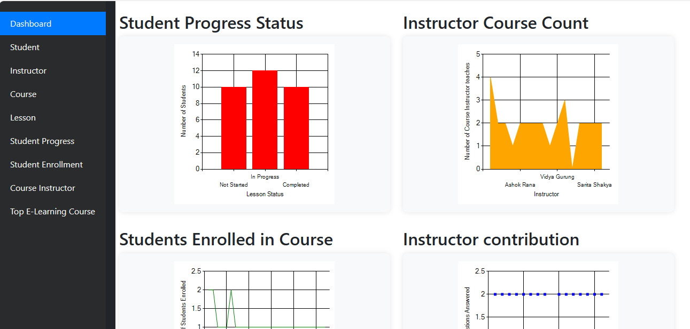

# E-Learning Platform

## Description

This E-Learning Platform is made using ASP.NET Web Forms. It serves as a school management system with basic and complex forms, CRUD operations, and queries to filter data. The platform allows users to manage students, instructors, courses, lessons, track student progress, and more.

## Dashboard

